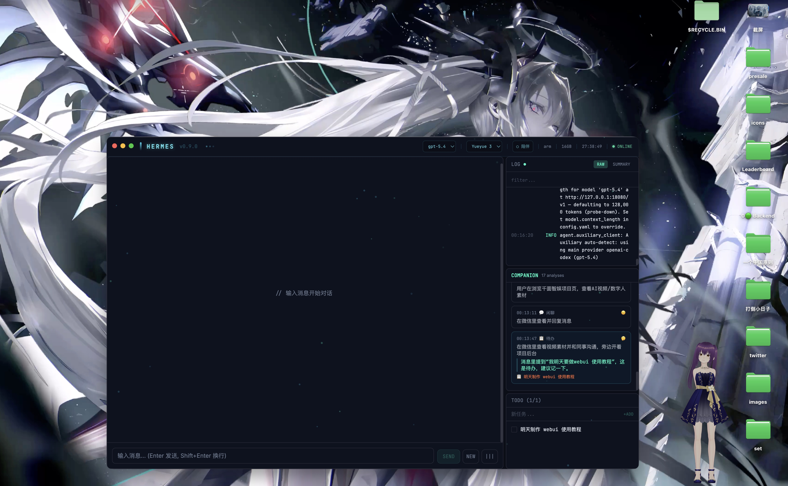

# Hermes WebUI

深色桌面风格的 WebUI 与 Electron 外壳，为 Hermes Agent 提供实时聊天、工具调用流式展示、VRM 数字人、屏幕感知陪伴模式和 Spotlight 风格的快捷助手。

A dark, desktop-style WebUI and Electron shell for Hermes Agent, with live chat, tool-call streaming, a VRM digital human, screen-aware companion mode, and a Spotlight-style quick assistant.



[中文](#中文) | [English](#english)

---

<a id="中文"></a>

## 安装

### 一键安装（macOS）

```bash
curl -fsSL https://raw.githubusercontent.com/Catlina-2B/hermes-nyx/main/install.sh | bash
```

自动从 GitHub Releases 下载最新版本并安装到 `/Applications/`。已安装时运行同一命令即可更新。

### 手动安装

从 [Releases](https://github.com/Catlina-2B/hermes-nyx/releases) 下载 DMG，打开后拖入 Applications 文件夹。

## 功能特性

- **流式聊天 UI** — 基于 WebSocket，支持工具调用展示、结果预览和耗时统计
- **持久化聊天会话** — 支持会话切换和历史恢复
- **待办面板** — 基于 JSON 存储，与 Agent 共享任务状态
- **系统状态栏** — 显示模型名称、CPU、内存、运行时和 Hermes 版本
- **实时日志面板** — 基于 WebSocket 的日志流
- **VRM 数字人插件** — 响应聊天中的隐藏指令（如 `[expr:{...}]`）
- **桌面悬浮陪伴窗口** — 可拖拽的透明头像窗口
- **Spotlight 快捷输入** — 流式回答，支持屏幕上下文问答
- **陪伴分析 API** — 截图分析、间隔控制、自动创建待办

## 环境要求

### 系统要求

| 依赖 | 版本 |
|------|------|
| macOS | 12+（其他平台可能需要额外适配） |
| Python | 3.11+ |
| Node.js | 20+ |
| npm | 10+ |
| Git | 2.x |

### Hermes 运行时（必需）

本项目依赖本地安装的 Hermes Agent。运行前请确保以下路径存在：

```text
~/.hermes/hermes-agent    # Hermes Agent 运行时代码
~/.hermes/config.yaml     # Hermes 配置文件
~/.hermes/state.db        # 会话状态数据库
~/.hermes/logs/           # 日志目录
```

后端导入的 Hermes 模块：`run_agent.AIAgent`、`hermes_state.SessionDB`、`tools.todo_tool.TodoStore`。

可通过环境变量 `HERMES_HOME` 覆盖 Hermes 主目录（默认：`~/.hermes`）。

## 快速开始（开发模式）

### 1. 克隆仓库

```bash
git clone https://github.com/user/hermes-webui.git
cd hermes-webui
```

### 2. 一键环境初始化

```bash
bash init.sh
```

该脚本会自动创建 Python 虚拟环境、安装所有后端/前端/Electron 依赖并构建前端。

### 3. 启动开发服务

```bash
bash start.sh
```

启动后：

| 服务 | 地址 |
|------|------|
| 前端 (Vite) | http://localhost:5173 |
| 后端 (FastAPI) | http://localhost:8081 |
| API 文档 (Swagger) | http://localhost:8081/docs |

按 `Ctrl+C` 停止所有服务。

### 手动安装（备选方案）

```bash
# 后端
cd backend
python3 -m venv venv
source venv/bin/activate
pip install -r requirements.txt
uvicorn main:app --host 0.0.0.0 --port 8081

# 前端（另开终端）
cd frontend
npm install
npm run dev
```

## 运行 Electron 桌面应用

### 开发模式

```bash
# 1. 构建前端
cd frontend
npm install
npm run build

# 2. 启动 Electron
cd ../electron
npm install
npm start
```

Electron 会自动：
- 启动 Python 后端进程
- 通过 `HERMES_FRONTEND_DIST` 加载构建好的前端
- 打开主窗口、悬浮陪伴窗口和 Spotlight 窗口

### 环境变量

| 变量 | 说明 | 默认值 |
|------|------|--------|
| `HERMES_HOME` | Hermes 安装目录 | `~/.hermes` |
| `HERMES_FRONTEND_DIST` | 前端构建产物路径 | （由 Electron 设置） |
| `HERMES_MODEL_OPTIONS` | 逗号分隔的模型列表 | （来自 config.yaml） |

## 打包与分发

### 构建 macOS DMG

```bash
cd electron
npm run build
```

使用 `electron-builder` 生成 `.dmg` 安装包和解压目录。

构建配置（`electron/package.json`）：

- **App ID**: `com.hermes.desktop`
- **产品名**: Hermes
- **目标格式**: `dmg`、`dir`
- **打包资源**: 后端代码（排除 venv/pycache）+ 前端构建产物

### 仅构建目录（不生成 DMG）

```bash
cd electron
npm run build:dir
```

在 `electron/dist/mac-arm64/`（或对应架构目录）下生成应用，适合测试使用。

### 构建前准备

打包前请确保：

1. 前端已构建：`cd frontend && npm run build`
2. 后端依赖已安装（会被打包进应用）
3. `electron/icons/icon.icns` 存在（macOS 应用图标）

### 打包内容

```text
electron/
  main.js           # Electron 入口
  preload.js        # IPC 桥接
  icons/            # 应用图标
  + extraResources:
    backend/        # 完整后端代码（不含 .venv、__pycache__）
    frontend-dist/  # 前端构建产物（SPA）
```

> 注意：Python 运行时本身不会被打包。目标机器需要安装 Python 3.11+。如需完全独立分发，可考虑使用 PyInstaller 打包 Python 或使用 `python-build-standalone`。

## 测试

```bash
# 后端测试
cd backend
source .venv/bin/activate
pytest

# 前端构建检查与测试
cd frontend
npm run build
npx vitest run
```

## API 概览

| 端点 | 方法 | 说明 |
|------|------|------|
| `/api/health` | GET | 健康检查 |
| `/api/chat/history` | GET | 聊天历史 |
| `/api/chat/sessions` | GET | 会话列表 |
| `/api/chat/sessions/new` | POST | 创建新会话 |
| `/api/chat/sessions/{id}/switch` | POST | 切换会话 |
| `/api/chat/quick` | POST | 流式 SSE 响应（Spotlight） |
| `/ws/chat` | WS | 聊天 WebSocket |
| `/api/system/info` | GET | 系统信息 |
| `/api/todos` | GET/POST | 待办增删查 |
| `/api/todos/{id}` | PATCH/DELETE | 更新/删除待办 |
| `/api/todos/reorder` | POST | 待办排序 |
| `/api/companion/analyze` | POST | 截图分析 |
| `/api/companion/ask` | POST | 屏幕提问 |
| `/api/companion/status` | GET | 陪伴状态 |
| `/api/companion/toggle` | POST | 切换陪伴模式 |
| `/api/companion/history` | GET | 分析历史 |
| `/api/companion/interval` | POST | 设置分析间隔 |
| `/ws/logs` | WS | 日志流 |

## 项目结构

```text
.
├── backend/
│   ├── main.py                 # FastAPI 应用与 API 路由
│   ├── chat_manager.py         # Hermes Agent 桥接 + 会话/待办持久化
│   ├── config.py               # 配置与 Hermes 路径
│   ├── companion.py            # 截图/分析辅助
│   ├── log_monitor.py          # 原始 + 摘要日志流
│   ├── system_info.py          # 机器/模型/运行时元数据
│   ├── todo_store.py           # REST 待办辅助
│   ├── plugins/
│   │   └── vrm_digital_human.py
│   ├── requirements.txt
│   └── tests/
├── frontend/
│   ├── src/App.tsx             # 主桌面工作区
│   ├── src/companion/          # 透明悬浮头像 UI
│   ├── src/spotlight/          # Spotlight 快捷启动器 UI
│   ├── src/components/
│   ├── src/hooks/
│   └── src/plugins/vrm-digital-human/
├── electron/
│   ├── main.js                 # 应用启动、后端生命周期、窗口管理
│   ├── preload.js              # 安全 IPC 桥接
│   └── package.json            # Electron + electron-builder 配置
├── init.sh                     # 一键环境初始化脚本
├── start.sh                    # 开发启动脚本
└── features.json               # 功能追踪元数据
```

## 许可证

GPL-3.0 — 详见 [LICENSE](./LICENSE)。

---

<a id="english"></a>

## Installation

### One-line Install (macOS)

```bash
curl -fsSL https://raw.githubusercontent.com/Catlina-2B/hermes-nyx/main/install.sh | bash
```

Automatically downloads the latest release from GitHub and installs to `/Applications/`. Run the same command to update.

### Manual Install

Download the DMG from [Releases](https://github.com/Catlina-2B/hermes-nyx/releases) and drag to Applications.

## Features

- **Streaming chat UI** via WebSocket with tool-call visibility, result previews, and durations
- **Persistent chat sessions** with session switching and history restoration
- **Todo panel** backed by a JSON store shared with the agent
- **System status bar** showing model, CPU, memory, runtime, and Hermes version
- **Live log panel** via WebSocket
- **VRM digital human plugin** reacting to hidden chat directives like `[expr:{...}]`
- **Desktop floating companion window** with draggable transparent avatar
- **Spotlight-style quick input** with streamed answers and screen-context Q&A
- **Companion analysis APIs** for screenshot analysis, interval control, and auto-created todos

## Architecture

```text
frontend/   React + Vite + TailwindCSS UI
backend/    FastAPI bridge to Hermes Agent
electron/   Electron desktop wrapper and window orchestration
```

1. React renders the main chat workspace, companion panel, logs, todos, and avatar surfaces.
2. FastAPI exposes REST + WebSocket endpoints for chat, logs, system info, todos, and companion features.
3. `backend/chat_manager.py` boots `AIAgent` from the local Hermes install and forwards stream/tool events into the UI.
4. Electron starts the Python backend, serves the built frontend through FastAPI, and manages extra windows (floating companion, Spotlight overlay).

## Environment Requirements

### System

| Requirement | Version |
|------------|---------|
| macOS | 12+ (other platforms may need extra polish) |
| Python | 3.11+ |
| Node.js | 20+ |
| npm | 10+ |
| Git | 2.x |

### Hermes Runtime (required)

This project depends on a local Hermes Agent installation. Before running, ensure:

```text
~/.hermes/hermes-agent    # Hermes Agent runtime code
~/.hermes/config.yaml     # Hermes configuration
~/.hermes/state.db        # Session state database
~/.hermes/logs/           # Log directory
```

The backend imports Hermes modules: `run_agent.AIAgent`, `hermes_state.SessionDB`, `tools.todo_tool.TodoStore`.

You can override the Hermes home directory with the `HERMES_HOME` environment variable (default: `~/.hermes`).

### Backend Dependencies

Listed in `backend/requirements.txt`:

- fastapi, uvicorn, websockets
- psutil, pyyaml
- openai, fire, requests, rich, prompt_toolkit

### Frontend Dependencies

Listed in `frontend/package.json`:

- React 19, React DOM, Vite 6
- Three.js, @pixiv/three-vrm (for VRM digital human)
- TailwindCSS, react-markdown, react-grid-layout

### Electron Dependencies

Listed in `electron/package.json`:

- Electron 35+
- electron-builder 26+ (for packaging)

## Quick Start (Development)

### 1. Clone the repo

```bash
git clone https://github.com/user/hermes-webui.git
cd hermes-webui
```

### 2. One-shot environment setup

```bash
bash init.sh
```

This creates a Python venv, installs all backend/frontend/electron dependencies, and builds the frontend.

### 3. Start dev servers

```bash
bash start.sh
```

This starts:

| Service | URL |
|---------|-----|
| Frontend (Vite) | http://localhost:5173 |
| Backend (FastAPI) | http://localhost:8081 |
| API Docs (Swagger) | http://localhost:8081/docs |

Press `Ctrl+C` to stop both servers.

### Manual setup (alternative)

```bash
# Backend
cd backend
python3 -m venv venv
source venv/bin/activate
pip install -r requirements.txt
uvicorn main:app --host 0.0.0.0 --port 8081

# Frontend (in another terminal)
cd frontend
npm install
npm run dev
```

## Running the Electron App

### Development mode

```bash
# 1. Build frontend
cd frontend
npm install
npm run build

# 2. Start Electron
cd ../electron
npm install
npm start
```

Electron will automatically:
- Start the Python backend process
- Serve the built frontend via `HERMES_FRONTEND_DIST`
- Open the main window, floating companion window, and Spotlight window

### Environment variables

| Variable | Description | Default |
|----------|-------------|---------|
| `HERMES_HOME` | Hermes installation directory | `~/.hermes` |
| `HERMES_FRONTEND_DIST` | Path to built frontend dist | (set by Electron) |
| `HERMES_MODEL_OPTIONS` | Comma-separated model list | (from config.yaml) |

## Packaging & Distribution

### Build macOS DMG

```bash
cd electron
npm run build
```

This uses `electron-builder` to produce a `.dmg` installer and an unpacked app directory.

The build configuration in `electron/package.json`:

- **App ID**: `com.hermes.desktop`
- **Product Name**: Hermes
- **Targets**: `dmg`, `dir`
- **Bundled resources**: backend code (excluding venv/pycache) + frontend dist

### Build unpacked directory only

```bash
cd electron
npm run build:dir
```

This creates the app in `electron/dist/mac-arm64/` (or equivalent) without a DMG, useful for testing.

### Build prerequisites

Before packaging, ensure:

1. Frontend is built: `cd frontend && npm run build`
2. Backend dependencies are installed (they get bundled into the app)
3. `electron/icons/icon.icns` exists (for macOS app icon)

### What gets packaged

```text
electron/
  main.js           # Electron entry point
  preload.js        # IPC bridge
  icons/            # App icons
  + extraResources:
    backend/        # Full backend (sans .venv, __pycache__)
    frontend-dist/  # Built frontend SPA
```

> Note: The Python runtime itself is NOT bundled. The target machine needs Python 3.11+ installed. For a fully standalone distribution, consider bundling Python with PyInstaller or using a tool like `python-build-standalone`.

## Testing

```bash
# Backend tests
cd backend
source .venv/bin/activate
pytest

# Frontend build check & tests
cd frontend
npm run build
npx vitest run
```

## API Overview

| Endpoint | Method | Description |
|----------|--------|-------------|
| `/api/health` | GET | Health check |
| `/api/chat/history` | GET | Chat message history |
| `/api/chat/sessions` | GET | List sessions |
| `/api/chat/sessions/new` | POST | Create new session |
| `/api/chat/sessions/{id}/switch` | POST | Switch session |
| `/api/chat/quick` | POST | Streaming SSE response (Spotlight) |
| `/ws/chat` | WS | Chat WebSocket |
| `/api/system/info` | GET | System metadata |
| `/api/todos` | GET/POST | Todo CRUD |
| `/api/todos/{id}` | PATCH/DELETE | Update/delete todo |
| `/api/todos/reorder` | POST | Reorder todos |
| `/api/companion/analyze` | POST | Screenshot analysis |
| `/api/companion/ask` | POST | Ask about screen |
| `/api/companion/status` | GET | Companion status |
| `/api/companion/toggle` | POST | Toggle companion |
| `/api/companion/history` | GET | Analysis history |
| `/api/companion/interval` | POST | Set analysis interval |
| `/ws/logs` | WS | Log streaming |

## Project Structure

```text
.
├── backend/
│   ├── main.py                 # FastAPI app and API routes
│   ├── chat_manager.py         # Hermes Agent bridge + session/todo persistence
│   ├── config.py               # Configuration and Hermes paths
│   ├── companion.py            # Screenshot/analysis helpers
│   ├── log_monitor.py          # Raw + summarized log streaming
│   ├── system_info.py          # Machine/model/runtime metadata
│   ├── todo_store.py           # REST-facing todo helpers
│   ├── plugins/
│   │   └── vrm_digital_human.py
│   ├── requirements.txt
│   └── tests/
├── frontend/
│   ├── src/App.tsx             # Main desktop-style workspace
│   ├── src/companion/          # Transparent floating avatar UI
│   ├── src/spotlight/          # Spotlight-like quick launcher UI
│   ├── src/components/
│   ├── src/hooks/
│   └── src/plugins/vrm-digital-human/
├── electron/
│   ├── main.js                 # App bootstrap, backend lifecycle, windows
│   ├── preload.js              # Safe IPC bridge
│   └── package.json            # Electron + electron-builder config
├── init.sh                     # One-shot environment bootstrap
├── start.sh                    # Dev startup helper
└── features.json               # Feature tracking metadata
```

## License

GPL-3.0 — see [LICENSE](./LICENSE).
